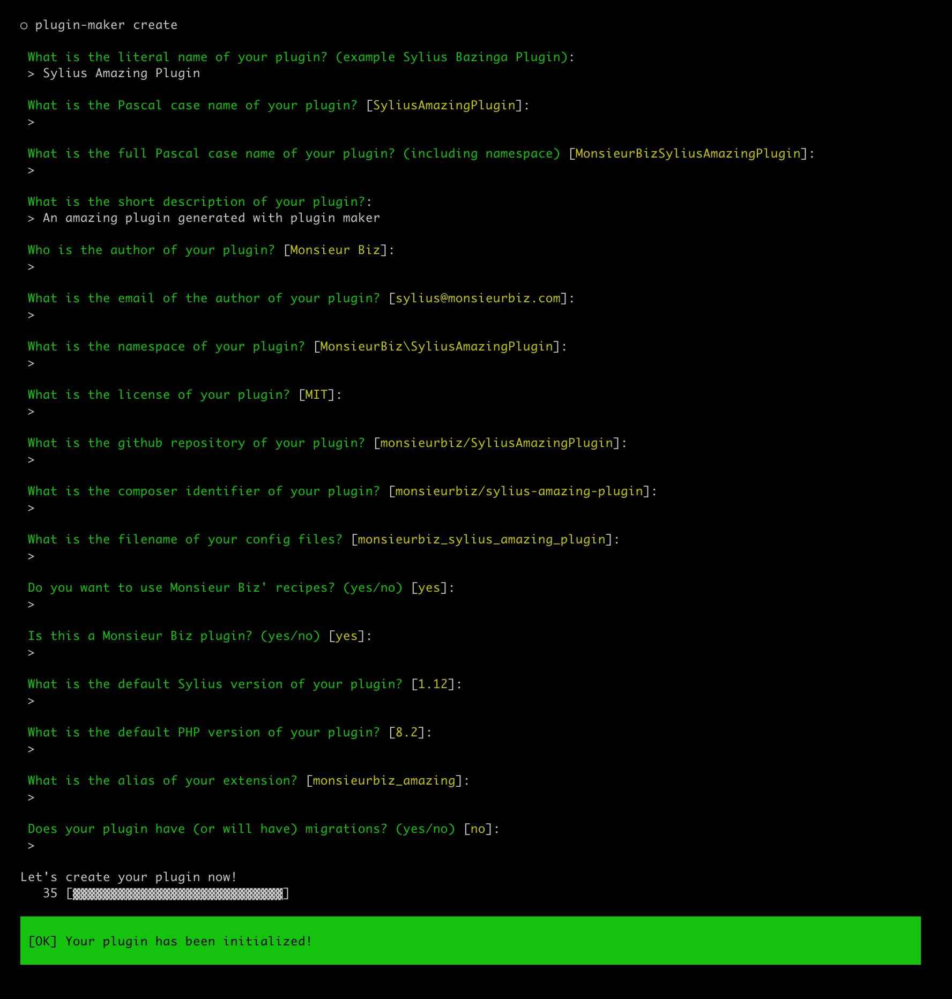
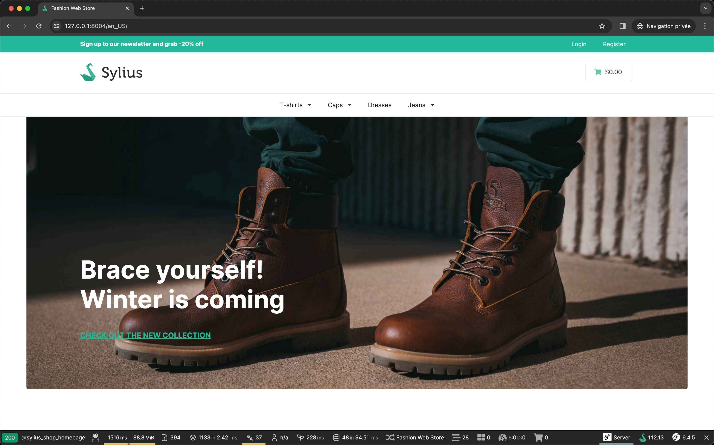

<p align="center">
    <a href="https://monsieurbiz.com" target="_blank">
        
    </a> 
    <a href="https://monsieurbiz.com/agence-web-experte-sylius" target="_blank">
        
    </a>
    <br/>
    
</p>

<h1 align="center">Monsieur Biz' Plugin Maker for Sylius</h1>

## How to use it

Simply download the binary or the phar using [the latest release](https://github.com/monsieurbiz/SyliusPluginMaker/releases/latest).

You need to go down to the assets section.

You can move and rename the binary to `plugin-maker` if you want to use it globally.

```bash
mv ~/Downloads/plugin-maker.darwin.phar ~/bin/plugin-maker
chmod +x ~/bin/plugin-maker
```

Then install the binary of the phar in your machine, and run `plugin-maker create`!

## Example

### Create your plugin



### Install it

```bash
cd SyliusAmazingPlugin
```


### Start coding !

You have a Sylius installed with your plugin, you can start coding your plugin. 🎉



## License

Under MIT.  
See [LICENSE](LICENSE).
